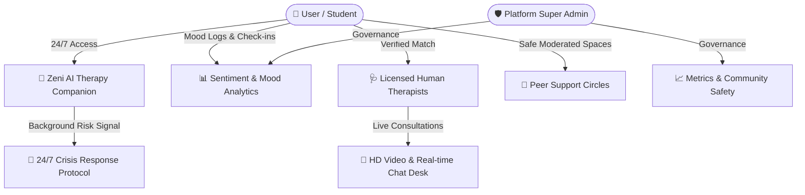

# 🌿 ZenMind — Real-Time Mental Wellness & AI-Human Therapy Platform

[](https://reactjs.org/)
[](https://www.typescriptlang.org/)
[](https://vitejs.dev/)
[](https://tailwindcss.com/)
[](LICENSE)
[](#)

> **ZenMind** is a state-of-the-art, end-to-end mental health platform designed specifically for college students, working professionals, and individuals seeking accessible, judgment-free emotional support. ZenMind bridges the gap between **24/7 AI companionship** (powered by Zeni AI) and **verified human therapy sessions**, complete with real-time mood tracking, peer support circles, and emergency crisis intervention protocols.

---

## 📋 Table of Contents

- [✨ Core Vision & Platform Capabilities](#-core-vision--platform-capabilities)
- [🏗️ System Architecture & Technology Stack](#%EF%B8%8F-system-architecture--technology-stack)
- [📱 Complete Dashboard Breakdown & Operator Guide](#-complete-dashboard-breakdown--operator-guide)
  - [1. 🎓 Student & User Wellness Dashboard](#1--student--user-wellness-dashboard)
  - [2. 🩺 Therapist Clinical Portal](#2--therapist-clinical-portal)
  - [3. 🛡️ Super Admin Platform Command Center](#3-%EF%B8%8F-super-admin-platform-command-center)
- [🌐 Sub-Pages & Interactive Overlays (13 Pages)](#-sub-pages--interactive-overlays-13-pages)
- [🔐 Security, Encryption & Crisis Protocols](#-security-encryption--crisis-protocols)
- [🚀 Quick Start & Local Setup](#-quick-start--local-setup)
- [🛠️ Build & Production Deployment](#%EF%B8%8F-build--production-deployment)

---

## ✨ Core Vision & Platform Capabilities

ZenMind is built to deliver immediate, compassionate, and continuous mental health support through a unified interface.



### Key Highlights
* 🤖 **Zeni 24/7 AI Therapy Companion**: Real-time conversational AI trained on Cognitive Behavioral Therapy (CBT) and Dialectical Behavior Therapy (DBT) frameworks. Supports English, Hindi, Hinglish, and regional Indian languages.
* 🩺 **On-Demand Licensed Therapist Desk**: Filter, match, and schedule 1-on-1 sessions with verified clinical psychologists, psychiatrists, and licensed counsellors.
* 📊 **Mood Journaling & Sentiment Tracking**: Daily mood logs, trigger tags, and weekly wellness trend reports with actionable emotional insights.
* 💬 **Moderated Student Peer Circles**: Topic-specific, anonymous support circles (exam anxiety, career stress, sleep hygiene, relationships) moderated 24/7.
* 🚨 **Automated Crisis Intervention**: Background safety evaluator that detects high-risk distress signals and immediately presents zero-tap emergency helpline connections (iCall, Kiran, Vandrevala, NIMHANS, 112).

---

## 🏗️ System Architecture & Technology Stack

ZenMind is architected using a decoupled, high-performance web architecture optimized for low latency and zero layout shifts.

### Frontend Stack
* **Framework**: React 18.3 with TypeScript (Vite 6.3 build engine)
* **Styling**: Custom Design Tokens, Vanilla CSS3, TailwindCSS 3.4
* **Aesthetics Palette**:
  * Deep Emerald (`#0a2617`) — Primary Dark Green Container
  * Forest Accent (`#0d5d3a`) — Interactive Buttons & Highlights
  * Warm Gold (`#d97706` / `#ffebc4`) — Primary Accent & Badges
  * Cream White (`#f8fdf9`) — Card Backgrounds
* **Animations**: Motion (`motion/react`), GSAP, Canvas 2D/3D (Rotational Globe)
* **Icons**: Lucide React Icons

### Backend & Real-Time API
* **Runtime**: Node.js & Express RESTful API Services
* **Database**: MongoDB with Mongoose Schemas + Memory Persistence Fallbacks
* **Real-time Engine**: WebSocket / Polling handlers for live chat & notifications
* **Authentication**: JWT & Role-Based Access Control (User, Therapist, Admin)

---

## 📱 Complete Dashboard Breakdown & Operator Guide

ZenMind features **three distinct role-tailored dashboards**, each crafted for maximum usability by non-technical operators and clinical practitioners alike.

---

### 1. 🎓 Student & User Wellness Dashboard

The primary hub for students and users to manage emotional health, access AI/human therapy, and track daily progress.

```
┌────────────────────────────────────────────────────────────────────────┐
│                        ZENMIND USER DASHBOARD                           │
├───────────────────┬────────────────────────────────────────────────────┤
│ 📌 Sidebar        │  📈 Main Canvas                                    │
│  - Mood Journal   │  ┌───────────────────────────────────────────────┐ │
│  - Zeni AI Chat   │  │  Weekly Insights Banner & Mood Graph         │ │
│  - Therapy Hub    │  └───────────────────────────────────────────────┘ │
│  - Peer Circles   │  ┌────────────────────────┐ ┌──────────────────┐ │
│  - Programs       │  │ Today's Mood Check-in  │ │ Scheduled Sessions│ │
│  - Resource Hub   │  └────────────────────────┘ └──────────────────┘ │
└───────────────────┴────────────────────────────────────────────────────┘
```

#### Key Sections & Operational Guide:

1. **Daily Mood Check-in & Journal**:
   * *How to Operate*: Click any mood emoji (Ecstatic, Calm, Anxious, Down, Overwhelmed), select primary emotion tags (e.g. *Exams, Sleep, Relationships*), add optional journal notes, and tap **"Save Log"**. View instant historical mood line charts and trigger summaries.
2. **Zeni AI Companion (24/7 Chat)**:
   * *How to Operate*: Click **"AI Therapy Chat"** from the sidebar or floating widget. Type your thoughts freely in natural language or Hinglish. Zeni offers grounding exercises, CBT reflection prompts, and immediate comfort. Click **"New Chat"** to clear session memory.
3. **Therapy Hub (Book Human Therapists)**:
   * *How to Operate*: Browse verified therapist cards filtered by expertise (Anxiety, Depression, Career, Trauma). Click **"View Profile"** to check credentials, consultation fee, and available slots. Select a date/time and click **"Book Session"**.
4. **Peer Support Circles**:
   * *How to Operate*: Select a circle (e.g. *Late Night Exam Stress* or *Career Uncertainty*). Join anonymous group conversations, share thoughts, or react to community messages in a safe, moderated room.
5. **Wellness Programs & Guided Paths**:
   * *How to Operate*: Select multi-day structured audio/text courses (e.g. *7 Days to Overcome Exam Panic*). Complete daily modules and track completion progress bars.
6. **Notification Center**:
   * *How to Operate*: Click the bell icon in the top header. View session reminders, therapist messages, and community updates. Click **"Clear"** or **"All Read"** to manage notifications instantly.

---

### 2. 🩺 Therapist Clinical Portal

Designed for licensed psychotherapists, psychiatrists, and counsellors to manage appointments, review client snapshots, and conduct live clinical consultations.

```
┌────────────────────────────────────────────────────────────────────────┐
│                       THERAPIST CLINICAL PORTAL                         │
├───────────────────┬────────────────────────────────────────────────────┤
│ 🩺 Navigation     │  📋 Active Client Roster                           │
│  - Client Snapshots│  ┌───────────────────────────────────────────────┐ │
│  - Live Desk      │  │  Client Name | Risk Level | Upcoming Session  │ │
│  - Reading Lists  │  └───────────────────────────────────────────────┘ │
│  - Schedule & Fees│  ┌────────────────────────┐ ┌──────────────────┐ │
│  - Support Desk   │  │ Live Consultation Room │ │ Session Prep Card│ │
│                   │  └────────────────────────┘ └──────────────────┘ │
└───────────────────┴────────────────────────────────────────────────────┘
```

#### Key Sections & Operational Guide:

1. **Client Wellness Snapshot**:
   * *How to Operate*: Access pre-session mood trends and aggregated emotional metrics shared voluntarily by clients before appointments to inform clinical care.
2. **Session Prep Cards**:
   * *How to Operate*: View client key notes, primary goals, past session outcomes, and clinical risk flags prior to starting consultations.
3. **Live Consultation Desk (HD Video & Chat)**:
   * *How to Operate*: When session time arrives, click **"Join Video Consultation"** or **"Open Live Chat"**. Conduct encrypted 1-on-1 sessions, send therapeutic reading lists, and log clinical post-session notes upon conclusion.
4. **Schedule & Pricing Management**:
   * *How to Operate*: Open **"Settings & Availability"**. Toggle available days, set working hours (e.g. *10:00 AM - 6:00 PM*), adjust session duration (45m / 60m), and update consultation fees. Click **"Save Schedule"** to sync live across client search results.
5. **Reading Lists Admin**:
   * *How to Operate*: Assign curated articles, mindfulness exercises, and psychoeducation guides directly to individual client dashboards.

---

### 3. 🛡️ Super Admin Platform Command Center

The central oversight portal for platform administrators to monitor platform health, approve clinical applications, moderate community spaces, and handle support desk tickets.

```
┌────────────────────────────────────────────────────────────────────────┐
│                   SUPER ADMIN PLATFORM COMMAND CENTER                   │
├───────────────────┬────────────────────────────────────────────────────┤
│ 🛡️ Admin Menu     │  📊 Platform Performance Metrics                   │
│  - Metrics & Logs │  ┌──────────────┐ ┌──────────────┐ ┌─────────────┐ │
│  - User Registry  │  │ Active Users │ │ Total Booked │ │ Revenue KPI │ │
│  - Therapists     │  └──────────────┘ └──────────────┘ └─────────────┘ │
│  - Peer Circles   │  ┌───────────────────────────────────────────────┐ │
│  - FAQ & Support  │  │ Therapist Application Approvals & Verification│ │
│                   │  └───────────────────────────────────────────────┘ │
└───────────────────┴────────────────────────────────────────────────────┘
```

#### Key Sections & Operational Guide:

1. **Platform Analytics & KPI Overview**:
   * *How to Operate*: Monitor total registered users, active daily chats, therapy sessions booked, platform revenue, and system uptime metrics in real time.
2. **Therapist Credentialing & Verification**:
   * *How to Operate*: Review incoming clinical applications. Click **"View Credentials"** to inspect license numbers, degrees, and ID proof. Click **"Approve Application"** to grant therapist portal access or **"Reject/Suspend"**.
3. **Peer Circle Safety & Moderation**:
   * *How to Operate*: Monitor reported community posts and safety alerts. Review flagged content, warn users, or delete inappropriate messages with one click.
4. **Support Desk & Contact Queries**:
   * *How to Operate*: View incoming support tickets, bug reports, and user feedback. Reply directly to tickets, assign severity levels, and mark queries as resolved.
5. **FAQ & Content Manager**:
   * *How to Operate*: Add, edit, or reorder public FAQ items and resource hub articles displayed across landing pages.

---

## 🌐 Sub-Pages & Interactive Overlays (13 Pages)

ZenMind includes **13 dedicated full-page overlays**, complete with header/footer navigation, smooth Lenis scroll, and consistent deep emerald aesthetics:

| # | Overlay Page | Purpose & Description |
|---|---|---|
| 1 | **About Us** | ZenMind's mission, founding team, clinical advisory board, and core philosophy. |
| 2 | **Careers** | Open job positions across engineering, clinical operations, and design with instant drawer application. |
| 3 | **Blog** | Psychoeducation articles, mental wellness guides, and research insights. |
| 4 | **Press** | Official company news, media announcements, and high-resolution brand asset downloads. |
| 5 | **Partners** | Institutional partnership tiers for universities, corporate wellness programs, and clinical networks. |
| 6 | **Help Center** | Searchable self-serve support categories, common Q&A cards, and support desk links. |
| 7 | **Privacy Policy** | Transparent data policies detailing end-to-end encryption, zero data selling, and HIPAA compliance. |
| 8 | **Terms of Service** | Usage terms, independent therapist practitioner rules, and payment terms. |
| 9 | **Crisis Support** | 24/7 verified emergency hotline directory (iCall, Kiran, Vandrevala, NIMHANS, 112) with instant tap-to-call. |
| 10 | **Community** | Peer circle directory, student stories, and community guidelines. |
| 11 | **Safety Guidelines** | Background risk signal protocols, crisis detection explanation, and moderation rules. |
| 12 | **Report Issue** | Full-width bug report form (`w-full`) with category selectors, severity tags, SLA metrics, and safety desk contacts. |
| 13 | **Feedback** | Full-width community feature request form (`w-full`) for direct product feedback. |

---

## 🔐 Security, Encryption & Crisis Protocols

Security and user privacy are foundational pillars of the ZenMind platform architecture.

* 🔒 **Data Encryption**: All network traffic is encrypted using **TLS 1.3**. Sensitive user records and session data are encrypted at rest using **AES-256**.
* 🛡️ **Anonymized AI Interactions**: Zeni AI conversations are processed in isolated memory spaces and never linked to publicly searchable profile IDs.
* 🚨 **Automated Crisis Response System**:
  ```
  User Message ──> Sentiment Analysis Engine ──> [Distress Keyword Triggered]
                                                         │
                                                         ▼
                                       Prompt Emergency Crisis Banner 
                                       + Present 24/7 Helpline Shortcuts (112, Kiran)
  ```

---

## 🚀 Quick Start & Local Setup

Follow these steps to run ZenMind on your local environment:

### Prerequisites
* **Node.js**: v18.0.0 or higher
* **npm**: v9.0.0 or higher

### 1. Clone & Install Dependencies
```bash
# Clone the repository
git clone https://github.com/zenmindteam/zenmind.git

# Navigate into project directory
cd ZenMindFinal

# Install frontend dependencies
npm install

# Install backend dependencies
cd backend
npm install
cd ..
```

### 2. Environment Configuration
Create a `.env` file in the root directory:
```env
VITE_API_URL=http://localhost:5000/api
PORT=5000
MONGODB_URI=mongodb://localhost:27017/zenmind
JWT_SECRET=your_super_secret_jwt_key
```

### 3. Run Development Servers
```bash
# Run Frontend Dev Server (Vite)
npm run dev

# In a separate terminal, run Backend Server
cd backend
npm run dev
```

Visit `http://localhost:5173` in your browser to launch ZenMind!

---

## 🛠️ Build & Production Deployment

To validate or build the production bundle:

```bash
# Build frontend bundle
npm run build

# Preview production build locally
npm run preview
```

Output assets are generated in the `/dist` folder, optimized for distribution via Vercel, Render, or Netlify.

---

<p center="true" align="center">
  Made with ❤️ by the <strong>ZenMind Team</strong> · Empowering Mental Wellness Nationwide 🌿
</p>
