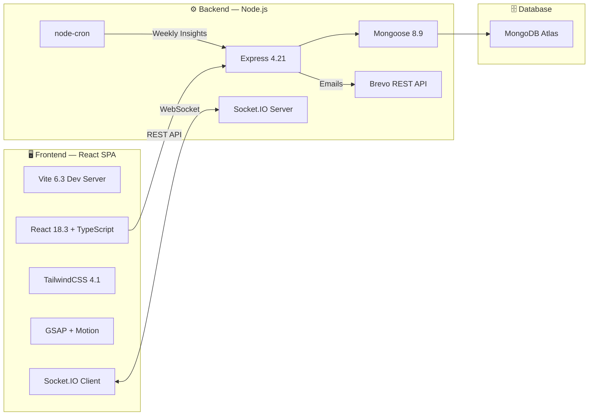

<p align="center">
  
</p>

<h1 align="center">ZenMind — AI-Powered Mental Wellness & Therapy Platform</h1>

<p align="center">
  <em>24/7 AI companionship · Licensed therapist sessions · Mood tracking · Peer circles · Crisis support</em>
</p>

<p align="center">
  
  
  
  
  
  
  
  
  
</p>

---

## 📋 Table of Contents

- [🌿 What is ZenMind?](#-what-is-zenmind)
- [🏗️ Architecture & Tech Stack](#️-architecture--tech-stack)
- [👤 User Dashboard — 14 Tabs](#-user-dashboard--14-tabs)
- [🩺 Therapist Portal — 6 Tabs](#-therapist-portal--6-tabs)
- [🛡️ Admin Command Center — 20 Sections](#️-admin-command-center--20-sections)
- [🌐 Landing Page — 12 Sections](#-landing-page--12-sections)
- [📄 Overlay Pages — 13 Pages](#-overlay-pages--13-pages)
- [🔌 Backend API — 27 Route Modules](#-backend-api--27-route-modules)
- [🗄️ Database — 32 Models](#️-database--32-models)
- [⚡ Real-Time Features](#-real-time-features)
- [🔐 Security](#-security)
- [💳 Subscription Tiers](#-subscription-tiers)
- [📧 Email System](#-email-system)
- [🤖 AI Integration — Zeni](#-ai-integration--zeni)
- [🚀 Quick Start](#-quick-start)
- [🛠️ Environment Variables](#️-environment-variables)
- [📦 Deployment](#-deployment)
- [📁 Project Structure](#-project-structure)

---

## 🌿 What is ZenMind?

ZenMind is a full-stack mental wellness platform designed for college students, working professionals, and anyone seeking accessible mental health support. It bridges the gap between **24/7 AI therapy** and **verified human therapist sessions** — all under one roof.

### ✨ Core Capabilities

| Feature | Description |
|---------|-------------|
| 🤖 **Zeni AI Companion** | Conversational AI therapy assistant available 24/7 — supports CBT-based dialogue, grounding exercises, and emotional check-ins. Powered by external ML model (configurable via API). |
| 🩺 **Licensed Therapists** | Browse, filter, and book 1-on-1 sessions with verified clinical psychologists. Includes profile cards with specialization, experience, fees, and available slots. |
| 🎥 **Video Consultations** | Real-time peer-to-peer video calls using WebRTC with Socket.IO signaling — no third-party video service needed. |
| 💬 **Live Chat Desk** | Real-time encrypted messaging between users and assigned therapists via Socket.IO rooms. |
| 📊 **Mood Journaling** | Daily mood check-ins with emoji scales, emotion tags, and free-form journal entries. Historical trend graphs with weekly/monthly views. |
| 🎯 **Wellness Goals** | Set, track, and complete personal wellness milestones with progress bars and streaks. |
| 📚 **Wellness Programs** | Multi-day structured courses (7–21 days) with daily exercises covering anxiety relief, sleep hygiene, mindfulness, stress management, self-esteem building, and motivation. |
| 👥 **Peer Support Circles** | Topic-specific real-time group chat rooms (8 seeded categories) with moderation — anxiety, exam stress, sleep, loneliness, self-esteem, family, motivation, general wellness. |
| 🛒 **Wellness Store** | Digital asset marketplace with free and paid downloadable resources (journals, meditation scripts, affirmation cards, sleep stories). |
| 📖 **Reading Lists** | Curated reading assignments that therapists can share directly to their clients' dashboards. |
| 🏪 **Resource Hub** | Searchable library of videos, articles, audio guides, and external links organized by mental health topics. |
| 🔔 **Notifications** | Real-time notification center with push notification support (Web Push via VAPID). |
| 📈 **Weekly Insights** | AI-generated personalized weekly wellness reports delivered every Sunday via automated cron job. |
| 🚨 **Crisis Support** | Emergency helpline directory with tap-to-call access to verified Indian mental health helplines (iCall, Kiran, Vandrevala, NIMHANS, 112). |

---

## 🏗️ Architecture & Tech Stack



### Frontend

| Technology | Version | Purpose |
|-----------|---------|---------|
| React | 18.3.1 | UI framework with hooks-based state management |
| TypeScript | 5.5 | Type safety across all components |
| Vite | 6.3.5 | Build tool with HMR, proxy config, and asset bundling |
| TailwindCSS | 4.1.12 | Utility-first styling with custom design tokens |
| GSAP | 3.15 | ScrollTrigger animations, parallax effects |
| Motion (Framer) | 12.23 | AnimatePresence transitions and micro-interactions |
| Lenis | 1.3 | Smooth scroll provider for landing page |
| Socket.IO Client | 4.8.3 | Real-time chat and video signaling |
| Recharts | 2.15 | Dashboard analytics charts and mood trend graphs |
| Chart.js | 4.5 | Additional chart types for admin analytics |
| Radix UI | Various | Accessible primitives (dialogs, dropdowns, tabs, etc.) |
| Lucide React | 0.487 | Icon system (300+ icons used across dashboards) |
| React Hook Form | 7.55 | Form validation and submission handling |
| Embla Carousel | 8.6 | Carousel/slider components |
| React DnD | 16.0 | Drag-and-drop interactions |
| Sonner | 2.0 | Toast notification system |
| DOMPurify | 3.4 | XSS sanitization for rendered HTML content |

### Backend

| Technology | Version | Purpose |
|-----------|---------|---------|
| Node.js + Express | 4.21 | RESTful API server |
| MongoDB + Mongoose | 8.9.5 | Document database with 32 collection schemas |
| Socket.IO | 4.8.3 | Real-time WebSocket server for chat, circles, video |
| JWT (jsonwebtoken) | 9.0.2 | Stateless authentication with HTTP-only cookies |
| bcryptjs | 2.4.3 | Password hashing (10 rounds) |
| Helmet | 7.1 | HTTP security headers and CSP |
| express-rate-limit | 8.5 | 1000 req/15min per IP |
| express-mongo-sanitize | 2.2 | NoSQL injection prevention |
| xss-clean | 0.1.4 | XSS attack prevention |
| hpp | 0.2.3 | HTTP parameter pollution prevention |
| Zod | 3.23 | Runtime request validation |
| Multer | 1.4.5 | File upload middleware |
| node-cron | 4.2 | Scheduled weekly insight generation |
| Brevo (Sendinblue) | REST API | Transactional emails (booking confirmations, OTPs, cancellations) |
| web-push | 3.6.7 | VAPID-based browser push notifications |
| Razorpay | 2.9.6 | Payment gateway integration |
| Nodemailer | 8.0.7 | Fallback email transport |

---

## 👤 User Dashboard — 14 Tabs

After login, users land on a sidebar-navigated dashboard with the following tabs:

### 🩺 Therapy & Chat

| Tab | Description | How to Use |
|-----|-------------|------------|
| **AI Chat** | Start a conversation with Zeni, the AI therapy companion. Supports natural language, Hinglish, and structured CBT-style dialogues. | Click "AI Chat" → type freely → Zeni responds with grounding techniques, reflections, and coping strategies. Click "New Chat" to start fresh. Credits are tracked per subscription tier. |
| **Therapy Hub** | Browse verified therapists with filters for specialization, session type (online/offline), and pricing. View full profiles with education, experience, and clinic details. | Click "Therapy Hub" → browse therapist cards → "View Profile" → select a date/time slot → "Book Session". Payments are processed via Razorpay. |
| **My Sessions** | View all booked sessions — upcoming, completed, and cancelled. Join video rooms when session time arrives. | Click "My Sessions" → see session cards with status → "Join Video Room" for active sessions. Sessions auto-cancel after 10-min no-show grace period. |

### 📊 Wellness Tracking

| Tab | Description | How to Use |
|-----|-------------|------------|
| **My Progress** | Central dashboard showing mood trends, session history, weekly insights banner, and wellness score overview. | This is the default landing tab. View your mood graph, read the latest AI-generated weekly insight, and track overall progress. |
| **Mood Journal** | Record daily mood entries with emoji-based mood scale, emotion tags (exam stress, sleep, relationships), and free-form notes. View historical mood charts. | Click "Mood Journal" → select today's mood emoji → tag primary emotions → write optional notes → "Save Log". Scroll down to view mood trend charts. |
| **My Goals** | Set personal wellness goals with deadlines, track daily progress, and celebrate completions. | Click "My Goals" → "Add Goal" → set title, description, target date → track daily check-ins against each goal. |

### 📚 Resources & Programs

| Tab | Description | How to Use |
|-----|-------------|------------|
| **Resources** | Searchable library of curated wellness content — videos, articles, audio guides, and external links tagged by topic. | Click "Resources" → browse by category or search → click any resource card to view/play. Favourite resources are saved to your profile. |
| **Reading Lists** | View reading assignments shared by your assigned therapist. | Click "Reading Lists" → browse therapist-assigned content → mark items as read. |
| **Wellness Programs** | Multi-day structured courses with daily exercises. Categories: anxiety, sleep, mindfulness, stress, self-esteem, motivation. | Click "Wellness Programs" → enroll in a program → complete daily steps (breathing, journaling, meditation, movement) → track completion progress. |
| **Store** | Digital wellness asset marketplace with free and paid downloads (PDF journals, meditation scripts, affirmation card packs). | Click "Store" → browse assets by category → download free items or purchase paid items. |

### 👥 Community

| Tab | Description | How to Use |
|-----|-------------|------------|
| **Community** | Public community wall for sharing wellness stories, peer encouragement, and social feed interactions. | Click "Community" → read community stories → share your own experience → react to posts. |
| **Peer Circles** | Real-time topic-specific group chat rooms. 8 categories: Anxiety Support, Exam Stress, Sleep Struggles, Loneliness, Self-Esteem, Family, Motivation, General Wellness. | Click "Peer Circles" → select a circle → join the room → send messages in real time. Messages are moderated by admins. |

### ⚙️ Account

| Tab | Description | How to Use |
|-----|-------------|------------|
| **Settings** | Manage profile (name, email, phone, avatar), change password, toggle dark/light theme, manage notification preferences, and view subscription tier. | Click "Settings" → update any field → "Save Changes". Toggle "Share Progress with Therapist" to allow therapists to view your mood data pre-session. |

---

## 🩺 Therapist Portal — 6 Tabs

Licensed therapists log in through a separate portal (`Therapist Login`) and access:

| Tab | Description | How to Use |
|-----|-------------|------------|
| **My Profile** | View and edit personal/professional information — name, photo, specialization, experience, education, clinic address, languages, about section, and clinic images. Also shows Aadhaar/identity card status (admin-managed). | Click "My Profile" → update any editable field → "Save Profile". License and identity documents are verified by admins. |
| **Schedule** | Configure session duration (30/45/60 min), session cost (₹), session type (online/offline/both), and available time slots. | Click "Schedule" → set duration and cost → add available time slots → "Save Schedule". Changes reflect immediately on user-facing therapist cards. |
| **Booked Sessions** | View all upcoming and past sessions with client details. Join video consultation rooms. Includes session prep cards with client mood data (if shared). | Click "Booked Sessions" → see session list → "Join Video Room" when session time arrives → conduct session → log post-session notes. |
| **Chats** | Real-time messaging desk with assigned clients. Full chat history with message timestamps, read receipts, and delete-for-everyone. | Click "Chats" → select a client → send messages in real time. Chat uses Socket.IO for instant delivery. |
| **Reading Lists** | Create and manage curated reading lists to share with individual clients. | Click "Reading Lists" → "Create New List" → add articles/resources → assign to specific clients. |
| **Support & Reports** | View and manage support tickets filed by clients, report issues, and handle administrative requests. | Click "Support & Reports" → view open tickets → respond or escalate → mark as resolved. |

---

## 🛡️ Admin Command Center — 20 Sections

Platform administrators log in through `Admin Login` (default: `AdminZ` / `adminZEN`) and access a comprehensive command center:

### 📊 Analytics
| Section | Description |
|---------|-------------|
| **Analytics Dashboard** | Platform-wide metrics: total users, active sessions, revenue KPIs, mood distribution charts, session booking trends, and user growth graphs. Uses Recharts and Chart.js. |

### 🔧 Management (18 Sections)

| Section | Description |
|---------|-------------|
| **Members Directory** | Search, view, edit, suspend/unsuspend user accounts. Assign subscription tiers (Free/Silver/Gold/Platinum). View user mood history and session logs. |
| **Therapists Directory** | View all therapist profiles. Approve/reject applications. Verify credentials (license, Aadhaar, education). Suspend/unsuspend therapists. Edit therapist details including identity documents. |
| **Content Management** | Manage community stories (approve/reject user-submitted stories). Edit site-wide statistics (active users count, satisfaction rate, therapist count). |
| **FAQs Management** | Create, edit, reorder, and delete FAQ entries displayed across the platform. |
| **Peer Circles** | Monitor and moderate all 8 peer support circles. Delete inappropriate messages. View circle activity metrics. |
| **Flagged Content** | Review content flagged by automated moderation or user reports. Take action (warn, delete, suspend user). |
| **Reading Lists** | Admin-level management of all reading lists created by therapists. |
| **Wellness Programs** | Create, edit, and manage multi-day wellness programs. Configure steps, exercise types, and duration for each day. |
| **Wellness Store** | Add, edit, price, and manage digital assets in the wellness store. Upload PDF resources. |
| **Quiz Questions** | Manage therapist-matching quiz questions and scoring logic used in the TherapistMatchQuiz flow. |
| **Support Tickets** | View and respond to user support tickets. Assign severity levels. Mark as resolved. |
| **Therapist Inbox** | Monitor therapist-specific reports, escalations, and inter-therapist communication. |
| **Crisis Monitor** | View crisis logs triggered by high-risk distress signals. Track crisis intervention history. |
| **Notifications** | Send platform-wide or targeted notifications to users. View notification delivery status. |
| **Session Insights** | Aggregate session analytics — completion rates, cancellation rates, therapist performance metrics. |
| **Team Members** | Manage internal team members displayed on the About page. Add/edit team profiles. |
| **Job Postings** | Create, edit, and manage career listings. View application submissions with filtering by department and status. |
| **Applications** | Review incoming job applications. View candidate details, resumes, and cover letters. |

### ⚙️ Settings
| Section | Description |
|---------|-------------|
| **Settings** | Platform-wide configuration — environment variables, site settings, and feature toggles. |

---

## 🌐 Landing Page — 12 Sections

The public-facing landing page features smooth Lenis scroll and GSAP-powered animations:

| # | Section Component | Description |
|---|---|---|
| 1 | **Navbar** | Floating navigation with links to Product, Company, and Resources pages. Get Started CTA, Admin Login, and Therapist Login triggers. |
| 2 | **HeroSection** | Full-viewport hero with animated headline, CTA buttons, and decorative elements. |
| 3 | **ParadigmSection** | Platform philosophy — introduces ZenMind's mental health approach. |
| 4 | **MindOverMatterSection** | Feature highlights with scroll-triggered animations. |
| 5 | **HowItWorksSection** | Step-by-step onboarding flow explanation. |
| 6 | **TherapyRevealSection** | Therapy booking feature showcase with CTA to book sessions. |
| 7 | **BelieveSection** | Trust-building section with platform values. |
| 8 | **ProfessionalsSection** | Therapist profiles preview with booking CTA. |
| 9 | **CommunityStoriesSection** | User testimonial carousel with real community stories. |
| 10 | **PlatformImpactSection** | Live platform statistics (active users, satisfaction rate, therapist count). |
| 11 | **InspirationSection** | Motivational content section. |
| 12 | **GetInTouchSection** | Contact form with full-width card design, rounded borders. |
| 13 | **Footer** | Footer navigation with links to all product, company, and resources pages. |

---

## 📄 Overlay Pages — 13 Pages

Full-page overlays accessible from the navbar and footer, each with `LandingNavbar`, `LandingFooter`, smooth scroll, and hidden scrollbar:

| # | Page | Component | Description |
|---|------|-----------|-------------|
| 1 | **Features** | `ProductPage` | Detailed feature breakdown of the ZenMind platform. |
| 2 | **FAQ** | `ProductPage` | Frequently asked questions with expandable accordion. |
| 3 | **About Us** | `AboutPage` | Mission, founding story, team profiles, and clinical advisory board. |
| 4 | **Careers** | `CareersPage` | Open positions across departments. Includes inline application drawer. 6 seeded job listings. |
| 5 | **Blog** | `ComingSoonPage` | Coming soon placeholder. |
| 6 | **Press** | `ComingSoonPage` | Coming soon placeholder. |
| 7 | **Partners** | `ComingSoonPage` | Coming soon placeholder. |
| 8 | **Help Center** | `ResourcesPage` | Self-serve support categories and common Q&A. |
| 9 | **Privacy Policy** | `ResourcesPage` | Data handling policies, encryption details. |
| 10 | **Terms of Service** | `ResourcesPage` | Platform usage terms and payment terms. |
| 11 | **Crisis Support** | `ResourcesPage` | 24/7 emergency helpline directory — iCall, Kiran, Vandrevala, NIMHANS, 112. |
| 12 | **Community** | `ResourcesPage` | Peer circle info, community guidelines, and stories. |
| 13 | **Safety Guidelines** | `ResourcesPage` | Moderation rules, crisis detection explanation, and safety protocols. |
| 14 | **Report Issue** | `ResourcesPage` | Full-width bug report form with category/severity selectors. |
| 15 | **Feedback** | `ResourcesPage` | Full-width feedback form for feature requests and suggestions. |
| 16 | **Contact Us** | `ContactPage` | Contact form with full-width card matching landing page design. |

---

## 🔌 Backend API — 27 Route Modules

All routes are prefixed with `/api/`. Authentication uses JWT stored in HTTP-only cookies.

| Route Module | Base Path | Key Endpoints |
|---|---|---|
| `auth` | `/api/auth` | `POST /register`, `POST /login`, `POST /logout`, `POST /forgot-password`, `POST /verify-otp`, `POST /reset-password` |
| `me` | `/api/me` | `GET /` (profile), `PUT /` (update profile), `PUT /password`, `PUT /avatar`, `PUT /share-progress` |
| `admin` | `/api/admin` | User CRUD, therapist approval/rejection, content management, site settings, team members, quiz questions, crisis logs |
| `adminAnalytics` | `/api/admin-analytics` | Platform metrics, user growth, session stats, revenue KPIs, mood distributions |
| `therapist` | `/api/therapist` | `POST /login`, `GET /me`, therapist profile CRUD, schedule management, availability |
| `session` | `/api/sessions` | Session booking, cancellation (with 10-min grace period), session status updates, refund processing |
| `sessionPrep` | `/api/session-prep` | Pre-session client mood snapshots, session prep cards for therapists |
| `chat` | `/api/chat` | Chat creation, message history, message deletion (delete-for-me / delete-for-everyone) |
| `zenChat` | `/api/zen-chat` | Zeni AI conversation sessions — send messages to AI, receive responses, manage chat history |
| `zenSessions` | `/api/zen-sessions` | AI session metadata and analytics |
| `zenProgress` | `/api/zen-progress` | User progress tracking, mood analytics, streak data |
| `journal` | `/api/journal` | Mood journal CRUD — create entries, view history, mood trends |
| `goals` | `/api/goals` | Wellness goal CRUD — create, update progress, mark complete |
| `circles` | `/api/circles` | Peer circle listing, join/leave, message history, admin moderation |
| `resources` | `/api/resources` | Resource CRUD, search by tags, favourite/unfavourite |
| `readingLists` | `/api/reading-lists` | Therapist-to-client reading list assignment and management |
| `wellnessPrograms` | `/api/wellness-programs` | Program listing, enrollment, step completion tracking |
| `store` | `/api/store` | Store asset CRUD, download tracking, payment processing |
| `notifications` | `/api/notifications` | Notification CRUD, mark as read, clear all, push delivery |
| `push` | `/api/push` | VAPID push subscription registration and notification delivery |
| `insights` | `/api/insights` | AI-generated weekly wellness insights (also triggered by cron) |
| `communityStories` | `/api/community-stories` | Story submission, approval, listing, and reactions |
| `companyRoutes` | `/api/` | Team members, jobs, applications (public-facing company pages) |
| `faqs` | `/api/faqs` | FAQ listing and admin CRUD |
| `support` | `/api/support` | Support ticket submission |
| `public` | `/api/public` | Public-facing data (site settings, statistics) — no auth required |
| `health` | `/api/health` | `GET /api/health` — server health check |

---

## 🗄️ Database — 32 Models

All data is stored in MongoDB with Mongoose schemas:

| Model | Collection | Key Fields | Purpose |
|-------|-----------|------------|---------|
| `User` | users | name, email, phone, age, gender, passwordHash, subscriptionTier, aiWeeklyCredits, onboardingData, favouriteResources, shareProgressWithTherapist | Platform users |
| `Admin` | admins | username, passwordHash | Platform administrators |
| `Therapist` | therapists | name, email, password, specialization, experience, education, clinicAddress, sessionType, sessionCost, sessionTime, availableSlots, blockedUsers, aadharNumber, identityCardImage | Licensed therapists |
| `Session` | sessions | userId, therapistId, date, time, status, sessionType | Booked therapy sessions |
| `SessionFeedback` | sessionfeedbacks | sessionId, rating, feedback, recommendations | Post-session ratings |
| `SessionPrep` | sessionpreps | sessionId, clientNotes, goals, riskFlags | Pre-session preparation cards |
| `Chat` | chats | participants, lastMessage, updatedAt | Chat conversations |
| `Message` | messages | chatId, sender, senderModel, content, timestamp, deletedFor | Chat messages |
| `ZenSession` | zensessions | userId, startedAt, endedAt | AI chat session metadata |
| `ZenMessage` | zenmessages | sessionId, role, content, timestamp | AI chat messages |
| `DailyMood` | dailymoods | userId, mood, emotions, notes, date | Daily mood journal entries |
| `JournalEntry` | journalentries | userId, title, content, mood, tags, date | Extended journal entries |
| `WellnessGoal` | wellnessgoals | userId, title, description, targetDate, progress, completed | Personal wellness goals |
| `WeeklyInsight` | weeklyinsights | userId, content, generatedAt, weekStart | AI-generated weekly reports |
| `Circle` | circles | name, description, category, icon, gradientFrom, gradientTo | Peer support circle rooms |
| `CircleMessage` | circlemessages | circleId, userId, content, timestamp | Circle chat messages |
| `Resource` | resources | title, description, type, sourceType, url, youtubeVideoId, tags | Wellness resources library |
| `ReadingList` | readinglists | therapistId, userId, title, items | Therapist reading assignments |
| `WellnessProgram` | wellnessprograms | title, description, category, difficulty, durationDays, steps[] | Structured wellness courses |
| `StoreAsset` | storeassets | title, description, fileMime, fileName, price, category, fileData | Digital store products |
| `Notification` | notifications | userId, type, title, message, read, createdAt | User notifications |
| `PushSubscription` | pushsubscriptions | userId, endpoint, keys | Web Push subscriptions |
| `Story` | stories | story, author, rating, category, isApproved, userId | Community wellness stories |
| `SupportTicket` | supporttickets | userId, subject, message, status, priority | Support desk tickets |
| `TherapistTicket` | therapisttickets | therapistId, subject, message, status | Therapist-specific tickets |
| `TherapistReport` | therapistreports | therapistId, userId, type, content, status | Therapist report submissions |
| `CrisisLog` | crisislogs | userId, detectedKeywords, severity, actionTaken | Crisis detection audit log |
| `FAQ` | faqs | question, answer | Platform FAQ entries |
| `SiteSettings` | sitesettings | activeUsers, satisfactionRate, therapistsCount, supportAvailable | Platform statistics |
| `Job` | jobs | title, department, location, employmentType, salary, description, responsibilities, requirements, skills, slug, status, featured | Career listings |
| `TeamMember` | teammembers | name, role, image, bio, order | About page team profiles |
| `UserDownload` | userdownloads | userId, assetId, downloadedAt | Store download tracking |
| `PasswordReset` | passwordresets | email, otp, expiresAt | Password reset OTP tokens |

---

## ⚡ Real-Time Features

ZenMind uses **Socket.IO** for three real-time systems:

### 1. 💬 Therapist-User Live Chat
```
Client emits → 'join-chat' (chatId)
Client emits → 'send-chat-message' { chatId, message }
Server broadcasts → 'receive-chat-message' to room
Client emits → 'delete-chat-message' { chatId, messageId, deletedForEveryone }
Server broadcasts → 'chat-message-deleted' to room
```

### 2. 👥 Peer Support Circle Rooms
```
Client emits → 'join-circle' (circleId)
Client emits → 'circle-message' { circleId, message }
Server broadcasts → 'circle-new-message' to all in room
Admin emits → 'circle-message-deleted' { circleId, messageId }
Server broadcasts → 'circle-message-removed' to all in room
```

### 3. 🎥 WebRTC Video Consultations
```
Client emits → 'join-room' (roomId)
Server broadcasts → 'user-connected' (socketId)
Peer-to-peer → 'offer' / 'answer' / 'ice-candidate' signaling
On disconnect → 'user-disconnected' broadcast
```

### 4. ⏰ Scheduled Cron Job
```
Every Sunday at 8:00 AM IST → Generate AI weekly insights for all users
Uses node-cron: '30 2 * * 0' (UTC) with Asia/Kolkata timezone
```

---

## 🔐 Security

| Layer | Implementation |
|-------|---------------|
| **Authentication** | JWT tokens stored in HTTP-only, secure, SameSite=Strict cookies. Separate token namespaces for User, Therapist, and Admin. |
| **Password Hashing** | bcryptjs with 10 salt rounds. |
| **Rate Limiting** | 1000 requests per 15 minutes per IP via `express-rate-limit`. |
| **NoSQL Injection** | `express-mongo-sanitize` strips `$` and `.` from user input. |
| **XSS Prevention** | `xss-clean` middleware + DOMPurify on frontend. |
| **Parameter Pollution** | `hpp` middleware prevents duplicate query parameters. |
| **HTTP Headers** | `helmet` with strict CSP: script-src self, style-src self + Google Fonts, img-src self + data + https. |
| **CORS** | Strict origin checking — only `FRONTEND_URL` is allowed. |
| **File Uploads** | `multer` with size limits. Avatars stored as base64 in DB. |
| **Account Suspension** | Admin can suspend users/therapists with optional expiry date. Suspended users are auto-logged out. |
| **Video Encryption** | WebRTC provides end-to-end encryption via DTLS-SRTP. |

---

## 💳 Subscription Tiers

ZenMind uses a 4-tier subscription model with weekly AI credit limits:

| Tier | Weekly AI Credits | Cost | Features |
|------|------------------|------|----------|
| 🆓 **Free** | 10 | ₹0 | Basic AI chat, mood journaling, peer circles, free store assets |
| 🥈 **Silver** | 150 | Paid | Extended AI access, full resource library |
| 🥇 **Gold** | 250 | Paid | Priority AI access, premium programs |
| 💎 **Platinum** | ∞ Unlimited | Paid | Unlimited AI chat, all premium store assets, free therapy sessions, full program access |

Credits reset every Sunday at midnight IST. Paid subscriptions expire at the end of each month. Tier assignment is managed by admin via the Members Directory.

---

## 📧 Email System

ZenMind sends transactional emails via **Brevo (Sendinblue) REST API** — no SMTP dependency.

Email templates are custom HTML with ZenMind branding:
- ✅ Session booking confirmation
- ❌ Session cancellation notice
- 💰 Refund processing notification
- 🔐 Password reset OTP
- 📋 Therapist application status
- 🎉 Welcome email after registration
- 🚨 Crisis alert notifications

---

## 🤖 AI Integration — Zeni

Zeni is ZenMind's conversational AI therapy companion, powered by an external ML API:

- **Architecture**: Frontend sends user messages to `/api/zen-chat`, backend proxies to the configured AI endpoint (`ZENI_ML_API_URL`).
- **Model**: Configurable via `AI_MODEL` env var. Default endpoint is a Kaggle-hosted model accessible via ngrok tunnel.
- **Credit System**: Each AI response deducts 1 credit from the user's weekly allowance (based on subscription tier).
- **Context**: Conversation history is maintained per session for coherent multi-turn dialogue.
- **Safety**: Responses are sanitized and monitored for crisis keywords.

---

## 🚀 Quick Start

### Prerequisites
- **Node.js** ≥ 18.0.0
- **npm** ≥ 9.0.0
- **MongoDB** (local or MongoDB Atlas)

### 1. Clone & Install

```bash
git clone https://github.com/zenmindteam/zenmind.git
cd ZenMindFinal

# Frontend dependencies
npm install

# Backend dependencies
cd backend
npm install
cd ..
```

### 2. Configure Environment

```bash
# Backend — copy example and fill in values
cp backend/.env.example backend/.env
```

### 3. Run Development Servers

```bash
# Terminal 1 — Backend (port 5000)
cd backend
npm run dev

# Terminal 2 — Frontend (port 5173)
npm run dev
```

Visit **http://localhost:5173** 🚀

> **Note**: Vite is configured to proxy `/api`, `/uploads`, and `/socket.io` to `localhost:5000` in development.

### 4. Default Seeded Data

On first startup, the backend automatically seeds:
- 1 Admin account (`AdminZ` / `adminZEN`)
- 12 Therapists (7 online, 5 offline)
- 10 Community stories
- 10 Wellness resources
- 8 Peer support circles
- 6 Wellness programs (7–21 day courses)
- 5 Wellness store assets
- 8 FAQ entries
- 6 Job listings
- 1 Site settings document

---

## 🛠️ Environment Variables

### Backend (`backend/.env`)

| Variable | Required | Description |
|----------|----------|-------------|
| `PORT` | ✅ | Server port (default: `5000`) |
| `NODE_ENV` | ✅ | `development` or `production` |
| `FRONTEND_URL` | ✅ | Frontend origin for CORS (e.g. `http://localhost:5173`) |
| `MONGODB_URI` | ✅ | MongoDB connection string |
| `JWT_SECRET` | ✅ | 64+ hex char secret for JWT signing |
| `JWT_EXPIRES_IN` | ❌ | Token expiry (default: `7d`) |
| `BREVO_API_KEY` | ✅ | Brevo (Sendinblue) API key for transactional emails |
| `EMAIL_FROM` | ✅ | Verified sender email address |
| `EMAIL_FROM_NAME` | ❌ | Display name (default: `ZenMind`) |
| `ZENI_ML_API_URL` | ✅ | AI model endpoint URL (ngrok tunnel to Kaggle notebook) |
| `ZENI_ML_API_KEY` | ❌ | API key for AI model (if required) |
| `VAPID_PUBLIC_KEY` | ✅ | Web Push VAPID public key |
| `VAPID_PRIVATE_KEY` | ✅ | Web Push VAPID private key |
| `VAPID_CONTACT` | ✅ | VAPID contact email (`mailto:you@example.com`) |

### Frontend (`.env` or environment)

| Variable | Required | Description |
|----------|----------|-------------|
| `VITE_API_URL` | ✅ | Backend API base URL (e.g. `http://localhost:5000`) |

### Generating Keys

```bash
# JWT Secret
node -e "console.log(require('crypto').randomBytes(64).toString('hex'))"

# VAPID Keys
npx web-push generate-vapid-keys
```

---

## 📦 Deployment

ZenMind is configured for **Render** deployment via `render.yaml`:

### Services

| Service | Type | Build Command | Start Command |
|---------|------|---------------|---------------|
| `zenmind-backend` | Web Service (Node) | `npm install` | `node src/index.js` |
| `zenmind-frontend` | Static Site | `npm install && npm run build` | Serves `./dist` |

### Production Build

```bash
# Build frontend bundle
npm run build

# Output: ./dist/
# Deploy to Render, Vercel, or Netlify
```

The frontend uses SPA rewrites (`/* → /index.html`) for client-side routing.

---

## 📁 Project Structure

```
ZenMindFinal/
├── 📁 src/
│   ├── 📁 app/
│   │   ├── App.tsx                         # Root component — routing, auth, overlays
│   │   ├── 📁 api/
│   │   │   └── client.ts                   # API fetch wrapper with auth, timeout, CORS
│   │   ├── 📁 components/
│   │   │   ├── Dashboard.tsx               # User dashboard shell (sidebar + canvas)
│   │   │   ├── TherapistDashboard.tsx       # Therapist portal shell
│   │   │   ├── AdminDashboard.tsx           # Admin command center shell
│   │   │   ├── SidebarNav.tsx              # User sidebar (14 tabs)
│   │   │   ├── AdminSidebarNav.tsx          # Admin sidebar (20 sections)
│   │   │   │
│   │   │   ├── 🩺 Therapy & Chat
│   │   │   │   ├── ZenChat.tsx             # Zeni AI chat interface
│   │   │   │   ├── ZenChatSidebar.tsx      # AI chat session sidebar
│   │   │   │   ├── TherapyHub.tsx          # Therapist browsing & booking
│   │   │   │   ├── TherapistMatchQuiz.tsx  # Therapist matching quiz
│   │   │   │   ├── UserChat.tsx            # User-therapist live chat
│   │   │   │   ├── TherapistChatView.tsx   # Therapist-side chat view
│   │   │   │   ├── VideoRoom.tsx           # WebRTC video consultation
│   │   │   │   ├── PostSessionModal.tsx    # Post-session feedback form
│   │   │   │   ├── FakePaymentModal.tsx    # Payment flow (Razorpay)
│   │   │   │
│   │   │   ├── 📊 Wellness Tracking
│   │   │   │   ├── ZenProgressDashboard.tsx # Progress overview
│   │   │   │   ├── MoodCheckIn.tsx         # Daily mood emoji selector
│   │   │   │   ├── MoodJournal.tsx         # Mood journal with trends
│   │   │   │   ├── WellnessGoalTracker.tsx # Goals CRUD & tracking
│   │   │   │   ├── WeeklyInsightsBanner.tsx # AI weekly insights
│   │   │   │   ├── SessionInsightsWidget.tsx # Session analytics
│   │   │   │   ├── SessionPrepCard.tsx     # Pre-session prep cards
│   │   │   │   ├── ClientWellnessSnapshot.tsx # Therapist client view
│   │   │   │
│   │   │   ├── 📚 Resources & Programs
│   │   │   │   ├── ResourceHub.tsx         # Curated resource library
│   │   │   │   ├── ReadingListsUser.tsx    # User reading assignments
│   │   │   │   ├── ReadingListsTherapist.tsx # Therapist reading management
│   │   │   │   ├── ReadingListsAdmin.tsx   # Admin reading oversight
│   │   │   │   ├── WellnessProgramsUser.tsx # Program enrollment & progress
│   │   │   │   ├── WellnessProgramsAdmin.tsx # Admin program management
│   │   │   │   ├── WellnessStore.tsx       # User store interface
│   │   │   │   ├── WellnessStoreAdmin.tsx  # Admin store management
│   │   │   │
│   │   │   ├── 👥 Community
│   │   │   │   ├── CommunityWall.tsx       # Social feed & stories
│   │   │   │   ├── PeerCircles.tsx         # Real-time group chat
│   │   │   │
│   │   │   ├── 🛡️ Admin
│   │   │   │   ├── AdminAnalytics.tsx      # Analytics dashboard
│   │   │   │   ├── AdminFAQManager.tsx     # FAQ CRUD
│   │   │   │   ├── TherapistsManagement.tsx # Therapist directory
│   │   │   │   ├── TherapistInboxAdmin.tsx # Therapist inbox
│   │   │   │   ├── TherapistSupportDesk.tsx # Support desk
│   │   │   │   ├── ApplicationsAdmin.tsx   # Job applications
│   │   │   │   ├── JobsManagement.tsx      # Job postings
│   │   │   │   ├── TeamManagement.tsx      # Team members
│   │   │   │   ├── NotificationCenter.tsx  # Notification management
│   │   │   │
│   │   │   ├── 🌐 Public Pages
│   │   │   │   ├── AuthPage.tsx            # Login & registration
│   │   │   │   ├── AdminLogin.tsx          # Admin login
│   │   │   │   ├── TherapistLogin.tsx      # Therapist login
│   │   │   │   ├── OnboardingFlow.tsx      # Post-signup onboarding
│   │   │   │   ├── ProductPage.tsx         # Features & FAQ overlays
│   │   │   │   ├── AboutPage.tsx           # About Us page
│   │   │   │   ├── CareersPage.tsx         # Careers page
│   │   │   │   ├── ContactPage.tsx         # Contact form page
│   │   │   │   ├── ResourcesPage.tsx       # Help/Privacy/Terms/Crisis/etc.
│   │   │   │   ├── ComingSoonPage.tsx      # Blog/Press/Partners placeholder
│   │   │   │   ├── FeaturesPage.tsx        # Detailed features page
│   │   │   │   ├── LoadingScreen.tsx       # Initial loading animation
│   │   │   │
│   │   │   ├── 🎨 Landing Page Sections
│   │   │   │   └── 📁 landing/             # 16 landing page components
│   │   │   │       ├── Navbar.tsx
│   │   │   │       ├── HeroSection.tsx
│   │   │   │       ├── ParadigmSection.tsx
│   │   │   │       ├── MindOverMatterSection.tsx
│   │   │   │       ├── HowItWorksSection.tsx
│   │   │   │       ├── TherapyRevealSection.tsx
│   │   │   │       ├── BelieveSection.tsx
│   │   │   │       ├── ProfessionalsSection.tsx
│   │   │   │       ├── CommunityStoriesSection.tsx
│   │   │   │       ├── PlatformImpactSection.tsx
│   │   │   │       ├── InspirationSection.tsx
│   │   │   │       ├── GetInTouchSection.tsx
│   │   │   │       ├── Footer.tsx
│   │   │   │       ├── SmoothScrollProvider.tsx
│   │   │   │       ├── SanctuaryCTASection.tsx
│   │   │   │       └── AsciiDitherBackground.tsx
│   │   │   │
│   │   │   └── 📁 ui/                      # 54 Radix-based UI primitives
│   │   │       ├── button.tsx, card.tsx, dialog.tsx, ...
│   │   │       ├── globe.tsx               # 3D rotating globe animation
│   │   │       ├── dot-pattern.tsx         # SVG dot pattern background
│   │   │       ├── gradient-card.tsx       # Gradient-bordered cards
│   │   │       └── phone-carousel.tsx      # Mobile phone mockup carousel
│   │
│   └── 📁 assets/                          # Static images and SVGs
│
├── 📁 backend/
│   ├── package.json
│   ├── .env.example
│   └── 📁 src/
│       ├── index.js                        # Express server + Socket.IO + seeds + cron
│       ├── 📁 models/                      # 32 Mongoose schemas
│       ├── 📁 routes/                      # 27 route modules
│       ├── 📁 middleware/
│       │   ├── auth.js                     # JWT verification middleware
│       │   └── planCheck.js                # Subscription tier & credit enforcement
│       └── 📁 utils/
│           ├── mailer.js                   # Brevo REST API email sender (HTML templates)
│           ├── jwt.js                      # JWT sign & verify helpers
│           ├── cookieOptions.js            # HTTP-only cookie config
│           └── brevo.js                    # Brevo API key export
│
├── package.json                            # Frontend dependencies
├── vite.config.ts                          # Vite config with proxy + aliases
├── render.yaml                             # Render deployment config
├── FEATURES.md                             # Feature overview document
└── README.md                               # This file
```

---

<p align="center">
  Made with 💚 by the <strong>ZenMind Team</strong>
  <br/>
  <em>Empowering Mental Wellness Nationwide</em> 🌿
</p>
